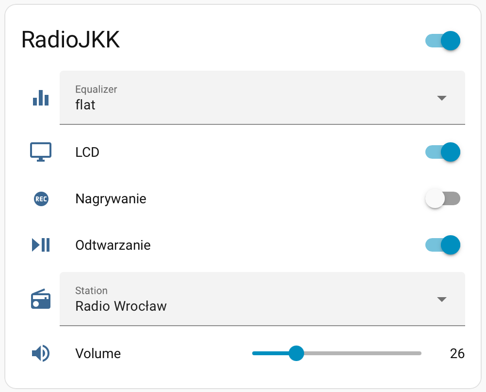

# RadioJKK32 - Multifunctional Internet Radio Player

**RadioJKK32** is an advanced internet radio project based on the ESP32-A1S (ESP32-A1S Audio Kit), built using ESP-ADF libraries and designed to provide seamless music playback with a wide range of features and control options.

## 🌟 Main Features

### 🏠 **Home Assistant Integration via MQTT - NEW!**

- **Automatic MQTT discovery** – entities appear in Home Assistant without manual YAML configuration
- **Full control** – station, equalizer, volume, play/stop, recording, LCD on/off
- **Real-time state sync** – all changes (from buttons, web, or HA) are instantly reflected everywhere
- **Easy setup** – broker found automatically via mDNS or set manually in the web interface

### 🌐 **Local Web Server**

- **Remote control** via a web browser: volume, station selection, equalizer adjustment
- **Dedicated LCD on/off button** in the web interface for manual display control (visible only if display is present)
- **Edit the radio station list** – modify, add, delete, and reorder entries  
- **Automatic network discovery** using mDNS/Bonjour/NetBIOS  
- **Responsive interface** that works on all devices  
- **Local access** without the need for an Internet connection  
- **Automatic SD card save** of the current station list  

### 📻 Audio Playback

- Supports many audio formats: **MP3, AAC, OGG, WAV, FLAC, OPUS, M4A, AMR**
- High-quality decoding and playback
- Automatic reconnect on connection issues

### 🔧 Audio Processing

- **10-band equalizer** with predefined presets
- Real-time audio level indicator (display required)
- Option to enable/disable audio processing (equalizer)

### 💾 Recording

- **Recording to SD card** in AAC format
- Automatic folder structure by date
- Info files with recording metadata
- Support for high-capacity SD cards

### 📱 User Interfaces

- **Local web server** – main control interface
- **OLED I2C (SSD1306/SH1107)** with LVGL graphical interface
- **GPIO keypad** with long press support
- **QR codes** (if display is present) for easy WiFi setup

### 💾 Saving Current Settings

- **Station, equalizer, and volume** are saved and restored after restart
- **Flash memory safety** – data is saved only after 10 seconds of change to avoid frequent writes
- **Flash durability** – with intense use (hundreds of changes/day) minimum 15 years lifespan

### 💾 Backup of Radio Station List

- **Save station list to SD card** in format compatible with RadioJKK

### 🔗 Connectivity

- **WiFi** with automatic provisioning via ESP SoftAP Prov app
- **MQTT** for Home Assistant integration (auto-discovery via mDNS or manual broker address)
- **mDNS/Bonjour, NetBIOS** for easy network discovery
- **SNTP** for time synchronization
- Configuration support via ESP SoftAP app

### ⚙️ Configuration and Management

- **Configuration via SD card** (stations, equalizer, WiFi)
- **NVS storage** for persistent settings
- **Automatic configuration loading** on startup

## 🚀 Getting Started

### Hardware Requirements

- **ESP32-A1S Audio Kit**
- **MicroSD card** (optional)
- **OLED I2C display** (optional)

Example offer: [App: ](https://s.click.aliexpress.com/e/_ooTic0A)[**AI Thinker ESP32-A1S**](https://s.click.aliexpress.com/e/_ooTic0A), [Web: ](https://s.click.aliexpress.com/e/_onbBPzW)[**AI Thinker ESP32-A1S**](https://s.click.aliexpress.com/e/_onbBPzW)

#### Recommended Display

OLED SSD1306 128x64 with I2C interface. Ideally with 4 built-in buttons, or connect separate buttons for convenience, e.g. [OLED SSD1306 128x64 with 4 buttons](https://s.click.aliexpress.com/e/_oFKo8XC)

#### Display Connection:

- SDA: **GPIO18**
- SCL: **GPIO5**

#### Optional External Button Connections:

- KEY4 [Up] **GPIO23**
- KEY3 [Down] **GPIO19**
- KEY2 [Eq/Rec] **GPIO13/MTCK** (note: change DIP switch settings)
- KEY1 [Stations] **GPIO22**

### Installation

1. **Clone the repository:**

   ```bash
   git clone --recurse-submodules https://github.com/MacWyznawca/RadioJKK.git
   cd radioJKK32
   ```

2. **Configure ESP-IDF and ESP-ADF:** Installation guide: [ESP-ADF](https://docs.espressif.com/projects/esp-adf/en/latest/get-started/index.html#quick-start). Repository: [ESP-ADF on GitHub](https://github.com/espressif/esp-adf).

   **Note:** for ESP-IDF 5.4.x and 5.5.x use:

   ```bash
   cd $IDF_PATH
   git apply $ADF_PATH/idf_patches/idf_v5.4_freertos.patch
   ```

3. **Build and flash:**

   ```bash
   idf.py build
   idf.py -p [your/COM port] flash monitor
   ```

   Exit monitor: Ctrl + ]

4. **Use precompiled file:**
   Flash selected file from the `bin` folder to address 0x0 using any ESP32 flashing tool:

   ```bash
   esptool.py -p /dev/cu.usbserial-0001 write_flash 0x0 bin/RadioJKK_v1.bin
   ```

## 📌 Configuration

### WiFi Configuration (default flow)

Provisioning app is **disabled by default** in release binaries. Use the built‑in SoftAP to set Wi‑Fi (works for both LCD and no‑LCD builds):

1. On boot, the device starts SoftAP: **SSID:** `RadioJKK-Setup`, **password:** `radiopass`
2. Connect to the AP, open the web UI at **http://192.168.4.1** (or **http://RadioJKK.local**)
3. Enter your Wi‑Fi SSID/password, click **Save & reboot**; device restarts and connects as STA
4. Next access: use **http://radiojkk32.local** or the obtained STA IP

Fallback: if STA fails (wrong creds or default menuconfig creds), the device auto-starts the same SoftAP to let you re-enter Wi‑Fi.

### WiFi via SD card (optional)

Create `settings.txt` file with SSID and password separated by a semicolon (single line):

```
mySSID;myPassword
```

If you don’t want to start the web server, add `wwwoff` after the semicolon:

```
mySSID;myPassword;wwwoff
```

### Radio Station List

Via web interface or SD card

Create `stations.txt` file on SD card in the format:

```
http://stream.url;ShortName;Long station name;0;1;audio_description
```

**Example:**

```
http://mp3.polskieradio.pl:8904/;PR3;Polskie Radio Program Trzeci;0;1;
http://stream2.nadaje.com:9248/prw.aac;RW;Radio Wrocław;0;5;
```

### Equalizer Presets

Create `eq.txt` file on the SD card:

```
flat;0;0;0;0;0;0;0;0;0;0
music;2;3;1;0;-1;-2;0;1;2;0
rock;4;5;3;1;-1;-3;-1;3;4;0
```

Always 10 EQ values in dB.

**Note:** all config files must be saved in the root of the SD card.

## 🌐 Web Server

### Access

- **Auto discovery:** `http://radiojkk32.local` (via mDNS/Bonjour). NetBIOS: `RadioJKK`
- **Direct IP:** `http://[device-ip-address]`
- **Port:** 80 (default)

### Web Server Functions

- 📻 **Playback control** (play/pause/stop)
- 🔊 **Real-time volume control**
- 📋 **Station selection** with full list
- 📋 **Edit station list** without physical access

## � Home Assistant Integration

RadioJKK supports automatic integration with **Home Assistant** via MQTT discovery. All entities are created automatically — no manual YAML configuration needed.



### Discovered Entities

| Entity | Type | Description |
|--------|------|-------------|
| Station | Select | Choose from the configured station list |
| Equalizer | Select | Choose equalizer preset |
| Volume | Number | Volume level 0–100% |
| Playback | Switch | Play / Stop with state indicator |
| Recording | Switch | Start / Stop recording to SD card |
| LCD | Switch | Display on / off |

### MQTT Broker Configuration

RadioJKK discovers the MQTT broker automatically via **mDNS** (service `_mqtt._tcp`). If your broker advertises this service (e.g. Mosquitto with Avahi), no manual configuration is needed.

To set the broker address manually:

1. Open the web interface: `http://radiojkk32.local`
2. Enter the MQTT broker address (e.g. `mqtt://192.168.1.100:1883`)
3. Optionally enter **Username** and **Password** if your broker requires authentication
4. Save — the device will reconnect immediately with the new settings (no restart needed)

### Requirements

- **MQTT broker** (e.g. Mosquitto) accessible on the local network
- **Home Assistant** with [MQTT integration](https://www.home-assistant.io/integrations/mqtt/) enabled and connected to the same broker

## �🎠 Button Controls (OLED-less Mode)

| Button        | Short Press          | Long Press         |
| ------------- | -------------------- | ------------------ |
| **PLAY** KEY3 | Previous station     | Favorite station   |
| **SET** KEY4  | Next station         | First station      |
| **MODE** KEY2 | Next equalizer       | Reset equalizer    |
| **REC** KEY1  | Start recording      | Stop recording     |
| **VOL+** KEY6 | Volume up            | -                  |
| **VOL-** KEY5 | Volume down          | Mute               |

## 🖥️ OLED Operation (if enabled)

| Button              | Short Press                | Long Press           |
| ------------------- | -------------------------- | -------------------- |
| **MODE** KEY1       | Station list/Confirm       | Close [ESC]          |
| **SET** KEY2        | Equalizer list             | Recording start/stop |
| **VOL+/-** KEY4/KEY3| Menu navigation / Volume   | Mute / Favorite      |

## ⚖️ Configuration Options

The project offers rich configuration via `menuconfig`:

```bash
idf.py menuconfig
```

### Available options:

- **Display type:** SSD1306/SH1107
- **Resolution:** 128x64
- **Button type:** GPIO
- **Board variant:** ESP32-A1S
- **SD card:** enable/disable
- **External keys:** optional

## 🌍 Internationalization

The project supports Polish diacritics with automatic UTF-8 to ASCII conversion for monochrome displays.

## 🤝 Contribution

You're welcome to contribute to the project!

1. **Fork** the repository
2. **Create a branch** for your feature
3. **Add changes** with descriptive commits
4. **Submit a Pull Request**

## 📄 License

This project is licensed under the **MIT License** – see the [LICENSE](LICENSE) file for details.

## 👏 Credits

- **Espressif Systems** for ESP-IDF and ESP-ADF
- **LVGL** for the graphics library
- **Open-source community** for support and inspiration

## 📞 Contact

- **Author:** Jaromir K. Kopp (JKK)
- **GitHub:** [MacWyznawca](https://github.com/MacWyznawca)

---

**RadioJKK32** – Internet radio with web control 🎵

