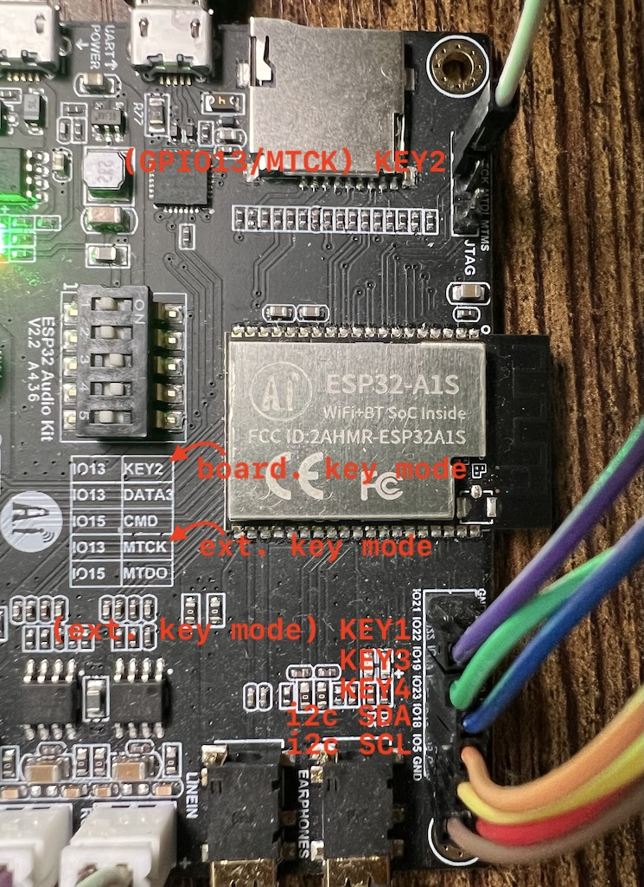

# RadioJKK32 - Multifunction Internet Radio Player

**RadioJKK32** is an advanced ESP32-A1S based internet radio project designed to provide a seamless listening experience with a wide range of features and control capabilities.

## 🌟 Key Features

### 🌐 **Local Web Server - NEW!**
- **Full remote control** through web browser
- **Real-time radio station list modification**
- **Automatic network discovery** via mDNS/Bonjour
- **Responsive interface** working on all devices
- **Local access** without internet connection required

### 📻 Audio Playback
- Multiple audio format support: **MP3, AAC, OGG, WAV, FLAC, OPUS, M4A, AMR**
- Internet streaming with automatic playlist parsing
- High-quality decoding and playback
- Automatic reconnection on connection issues

### 🔧 Audio Processing
- **10-band equalizer** with predefined presets
- Resampling for optimal audio quality
- Real-time audio level indicators
- Audio processing enable/disable capability

### 💾 Recording
- **SD card recording** in AAC format
- Automatic date-based folder structure creation
- Information files with recording metadata
- Support for high-capacity SD cards

### 📱 User Interfaces
- **Local web server** - primary control method
- **I2C OLED (SSD1306/SH1107)** with LVGL graphical interface
- **GPIO keypad** with long-press support
- **QR codes** for easy WiFi configuration

### 🔗 Connectivity
- **WiFi** with automatic provisioning via SoftAP
- **mDNS/Bonjour** for easy network discovery
- **SNTP** for time synchronization
- Configuration support through ESP SoftAP app

### ⚙️ Configuration and Management
- **SD card configuration** (stations, equalizer, WiFi)
- **NVS memory** for persistent settings storage
- **Automatic loading** of configuration at startup

## 🚀 Getting Started

### Hardware Requirements
- **ESP32-A1S Audio Kit** (variant 5 or 7)
- **MicroSD card** (optional)
- **I2C OLED display** (optional)

Example offers: [App: **AI Thinker ESP32-A1S**](https://s.click.aliexpress.com/e/_ooTic0A), [Web: **AI Thinker ESP32-A1S**](https://s.click.aliexpress.com/e/_onbBPzW) (affiliate)


#### Recommended Display

OLED SSD1306 128x64 with i2c bus. Preferably with built-in 4 buttons or provide separate buttons for more convenient usage, e.g. [OLED SSD1306 128x64 with four buttons](https://s.click.aliexpress.com/e/_oFKo8XC)

[](https://s.click.aliexpress.com/e/_oFKo8XC)

#### Display Connections:
- SDA: **GPIO18**
- SCL: **GPIO5**

#### Optional External Button Connections:
- KEY4 [Up] GPIO23
- KEY3 [Down] GPIO19
- KEY2 [Eq/Rec] GPIO13/MTCK (note: change dip switch settings)
- KEY1 [Stations] GPIO22



### Installation
1. **Clone repository:**
   ```bash
   git clone --recurse-submodules https://github.com/MacWyznawca/RadioJKK.git
   cd RadioJKK32
   ```

2. **Configure ESP-IDF and ESP-ADF:**
Installation description [ESP-ADF](https://docs.espressif.com/projects/esp-adf/en/latest/get-started/index.html#quick-start). Repository [ESP-ADF on GitHub](https://github.com/espressif/esp-adf).
   ```bash
   export ADF_PATH=/path/to/esp-adf
   export IDF_PATH=/path/to/esp-idf
   ```

3. **Build and flash:**
   ```bash
   idf.py build
   idf.py flash monitor
   ```

## 📋 Configuration

### WiFi Setup
For **QR code** scanning, proceed to step 3.
1. **On first boot** device creates access point "JKK..."
2. **Connect** to this access point and use ESP SoftAP app
3. **Scan QR code** displayed on OLED or enter data manually. PIN: jkk
4. **Enter WiFi credentials** for your network

Note: after the first configuration, if the web server is not responding, I recommend restarting the device.

Alternatively using SD card:

Create `settings.txt` file with WiFi network name and password separated by semicolon (one line of text):
```
mySSID;myPassword
```
If you don't want to start the web server, add at the end after semicolon: wwwoff
```
mySSID;myPassword;wwwoff
```

### Radio Station List
Via web interface or SD card

Create `stations.txt` file on SD card in format:
```
http://stream.url;ShortName;Long Station Name;0;1;audio_description
```

**Example:**
```
http://mp3.polskieradio.pl:8904/;PR3;Polish Radio Program Three;0;1;
http://stream2.nadaje.com:9248/prw.aac;RW;Radio Wrocław;0;5;
```

### Equalizer Presets
Create `eq.txt` file on SD card:
```
flat;0;0;0;0;0;0;0;0;0;0
music;2;3;1;0;-1;-2;0;1;2;0
rock;4;5;3;1;-1;-3;-1;3;4;0
```
Always 10 correction settings in dB

## 🌐 Web Server

### Server Access
- **Automatic discovery:** `http://radiojkk32.local` (via mDNS/Bonjour)
- **Direct IP:** `http://[device-ip-address]`
- **Port:** 80 (default)

### Web Server Features
- 📻 **Playback control** (play/pause/stop)
- 🔊 **Real-time volume control**
- 📝 **Station switching** with full available options list
- 📋 **Station list editing** without physical access
- 📱 **Responsive design** for all devices

## 🎛️ Button Controls (non-OLED mode)

| Button | Short Press | Long Press |
|--------|-------------|------------|
| **PLAY** | Previous station | Favorite station |
| **SET** | Next station | First station |
| **MODE** | Next equalizer | Reset equalizer |
| **REC** | Start recording | Stop recording |
| **VOL+** | Increase volume | - |
| **VOL-** | Decrease volume | Mute |

## 🖥️ OLED Controls (when enabled)

| Button | Short Press | Long Press |
|--------|-------------|------------|
| **MODE** | Station list | Confirm |
| **SET** | Equalizer list | Recording |
| **VOL+/-** | Menu navigation / Volume | Mute / Favorite |

## 🔧 Configuration Options

Project offers extensive configuration possibilities through `menuconfig`:

```bash
idf.py menuconfig
```

### Available Options:
- **Display type:** SSD1306/SH1107
- **Resolution:** 128x64
- **Button type:** GPIO
- **Board variant:** ESP32-A1S
- **SD card:** enable/disable
- **External keys:** optional

## 🌍 Internationalization

Project supports Polish diacritical characters with automatic UTF-8 to ASCII conversion for monochrome displays.

## 🤝 Contributing

We welcome contributions to the project!

1. **Fork** the repository
2. **Create branch** for your feature
3. **Add changes** with descriptive commits
4. **Submit Pull Request**

## 📄 License

This project is licensed under the **MIT License** - see [LICENSE](LICENSE) file for details.

## 🙏 Acknowledgments

- **Espressif Systems** for ESP-IDF and ESP-ADF
- **LVGL** for graphics library
- **Open-source community** for support and inspiration

## 📞 Contact

- **Author:** Jaromir K. Kopp (JKK)
- **GitHub:** [MacWyznawca](https://github.com/MacWyznawca)

---

**RadioJKK32** - Internet radio with browser control! 🎵