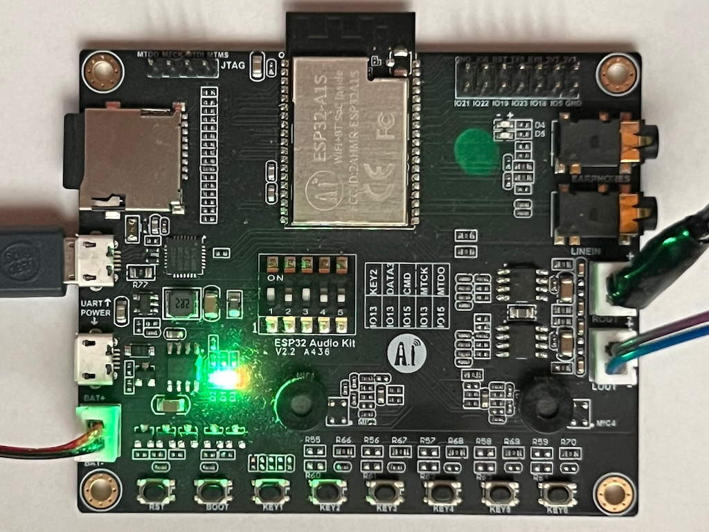
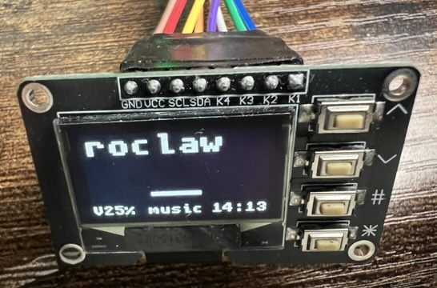
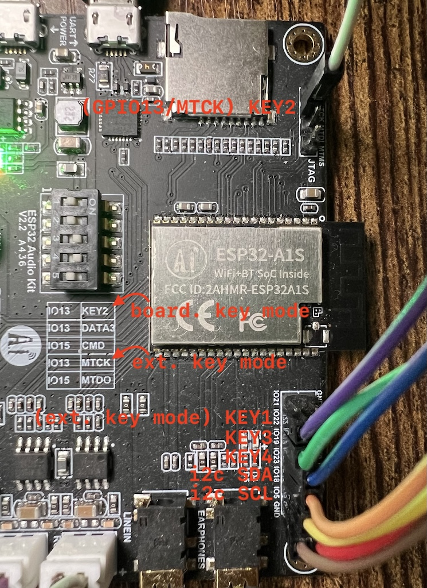

# RadioJKK32 - Wielofunkcyjny internetowy odtwarzacz radiowy

**RadioJKK32** to zaawansowany projekt internetowego radia opartego na ESP32-A1S, zaprojowany w celu zapewnienia płynnego słuchania muzyki z szeroką gamą funkcji i możliwości sterowania.

## 🌟 Główne funkcje

### 🌐 **Lokalny serwer WWW - NOWOŚĆ!**
- **Pełne zdalne sterowanie** przez przeglądarkę internetową
- **Modyfikacja listy stacji radiowych** w czasie rzeczywistym
- **Automatyczne wykrywanie w sieci** dzięki mDNS/Bonjour
- **Responsywny interfejs** działający na wszystkich urządzeniach
- **Dostęp lokalny** bez potrzeby połączenia z internetem

### 📻 Odtwarzanie audio
- Obsługa wielu formatów audio: **MP3, AAC, OGG, WAV, FLAC, OPUS, M4A, AMR**
- Strumieniowanie internetowe z automatycznym parsowaniem playlist
- Wysokiej jakości dekodowanie i odtwarzanie
- Automatyczne reconnect przy problemach z połączeniem

### 🔧 Przetwarzanie dźwięku
- **10-pasmowy equalizer** z predefiniowanymi ustawieniami
- Resampling dla optymalnej jakości dźwięku
- Wskaźnik poziomu audio w czasie rzeczywistym
- Możliwość włączania/wyłączania procesingu audio

### 💾 Nagrywanie
- **Nagrywanie do kart SD** w formacie AAC
- Automatyczne tworzenie struktury folderów według daty
- Pliki informacyjne z metadanymi nagrań
- Wsparcie dla kart SD o dużej pojemności

### 📱 Interfejsy użytkownika
- **Lokalny serwer WWW** - główny sposób sterowania
- **OLED I2C (SSD1306/SH1107)** z graficznym interfejsem LVGL
- **Klawiatura GPIO** z obsługą długich naciśnięć
- **Kody QR** dla łatwej konfiguracji WiFi

### 🔗 Łączność
- **WiFi** z automatycznym provisioningiem przez SoftAP
- **mDNS/Bonjour** dla łatwego odnajdywania w sieci
- **SNTP** dla synchronizacji czasu
- Obsługa konfiguracji przez aplikację ESP SoftAP

### ⚙️ Konfiguracja i zarządzanie
- **Konfiguracja przez kartę SD** (stacje, equalizer, WiFi)
- **Pamięć NVS** dla trwałego przechowywania ustawień
- **Automatyczne wczytywanie** konfiguracji przy starcie

## 🚀 Jak zacząć

### Wymagania sprzętowe
- **ESP32-A1S Audio Kit** (wariant 5 lub 7)
- **Karta microSD** (opcjonalnie)
- **Wyświetlacz OLED I2C** (opcjonalnie)

Przykładowa oferta: [App: **AI Thinker ESP32-A1S**](https://s.click.aliexpress.com/e/_ooTic0A), [Web: **AI Thinker ESP32-A1S**](https://s.click.aliexpress.com/e/_onbBPzW) (affiliate)



#### Zalecany wyświetlacz

OLED SSD1306 128x64 z magistralą i2c. Dobrze, jeśli ma wbudowane 4 przyciski lub zapewnij takie przyciski osobno dla wygodniejszego użytkowania np. [OLED SSD1306 128x64 z czterema przyciskami](https://s.click.aliexpress.com/e/_oFKo8XC)

[](https://s.click.aliexpress.com/e/_oFKo8XC)

#### Połączenie wuświetlacza:
- SDA: **GPIO18**
- SCL: **GPIO5**

#### Połączenia opcjonalnych przycisków zewnętrznych:
- KEY4 [Góra] GPIO23
- KEY3 [Dół] GPIO19
- KEY2 [Eq/Rec] GPIO13/MTCK (uwaga: zmień ustawienia przełączników dip)
- KEY1 [Stacje] GPIO22



### Instalacja
1. **Klonowanie repozytorium:**
   ```bash
   git clone --recurse-submodules https://github.com/MacWyznawca/RadioJKK.git
   cd RadioJKK32
   ```

2. **Konfiguracja ESP-IDF i ESP-ADF:**
Opis instalacji [ESP-ADF](https://docs.espressif.com/projects/esp-adf/en/latest/get-started/index.html#quick-start). Repozytorium [ESP-ADF na GitHub](https://github.com/espressif/esp-adf).  
   ```bash
   export ADF_PATH=/ścieżka/do/esp-adf
   export IDF_PATH=/ścieżka/do/esp-idf
   ```

3. **Kompilacja i wgranie:**
   ```bash
   idf.py build
   idf.py flash monitor
   ```

## 📋 Konfiguracja

### Konfiguracja WiFi
W przypadku skanowania kodu **QR** przejdź do punktu 3.
1. **Przy pierwszym uruchomieniu** urządzenie utworzy punkt dostępowy "JKK..."
2. **Połącz się** z tym punktem i użyj aplikacji ESP SoftAP
3. **Zeskanuj kod QR** wyświetlany na OLED lub wpisz dane ręcznie. Pin: jkk
4. **Wprowadź dane WiFi** swojej sieci

Alternatywnie za poomocą karty SD:

Utwórz plik `settings.txt` z nazwą sieci WiFi i hasłem oddzielonymi średnikiem (jedna linia tekstu):  
```
mySSID;myPassword
```
Jeżeli nie chcesz uruchamiać serwera WWW dodaj na końcu po średniku: wwwoff
```
mySSID;myPassword;wwwoff
```

### Lista stacji radiowych
Przez interfejs WWW lub kartę SD

Utwórz plik `stations.txt` na karcie SD w formacie:
```
http://stream.url;KrótkoNazwa;Długa nazwa stacji;0;1;opis_audio
```

**Przykład:**
```
http://mp3.polskieradio.pl:8904/;PR3;Polskie Radio Program Trzeci;0;1;
http://stream2.nadaje.com:9248/prw.aac;RW;Radio Wrocław;0;5;
```

### Predefiniowane ustawienia equalizera
Utwórz plik `eq.txt` na karcie SD:
```
flat;0;0;0;0;0;0;0;0;0;0
music;2;3;1;0;-1;-2;0;1;2;0
rock;4;5;3;1;-1;-3;-1;3;4;0
```
Zawsze 10 ustawień korekcji w dB

## 🌐 Serwer WWW

### Dostęp do serwera
- **Automatyczne wykrywanie:** `http://radiojkk32.local` (dzięki mDNS/Bonjour)
- **Bezpośredni IP:** `http://[adres-ip-urządzenia]`
- **Port:** 80 (domyślny)

### Funkcje serwera WWW
- 📻 **Sterowanie odtwarzaniem** (play/pause/stop)
- 🔊 **Regulacja głośności** w czasie rzeczywistym
- 📝 **Zmiana stacji** z pełną listą dostępnych opcji
- 📋 **Edycja listy stacji** bez potrzeby fizycznego dostępu
- 📱 **Responsywny design** dla wszystkich urządzeń

## 🎛️ Obsługa przycisków (tryb bez OLED)

| Przycisk | Krótkie naciśnięcie | Długie naciśnięcie |
|----------|-------------------|-------------------|
| **PLAY** | Poprzednia stacja | Ulubiona stacja |
| **SET** | Następna stacja | Pierwsza stacja |
| **MODE** | Następny equalizer | Reset equalizera |
| **REC** | Start nagrywania | Stop nagrywania |
| **VOL+** | Zwiększ głośność | - |
| **VOL-** | Zmniejsz głośność | Wycisz |

## 🖥️ Obsługa OLED (gdy włączone)

| Przycisk | Krótkie naciśnięcie | Długie naciśnięcie |
|----------|-------------------|-------------------|
| **MODE** | Lista stacji | Potwierdź |
| **SET** | Lista equalizer | Nagrywanie |
| **VOL+/-** | Nawigacja w menu / Głośność | Mute / Ulubiona |


## 🔧 Opcje konfiguracji

Projekt oferuje szerokie możliwości konfiguracji przez `menuconfig`:

```bash
idf.py menuconfig
```

### Dostępne opcje:
- **Typ wyświetlacza:** SSD1306/SH1107
- **Rozdzielczość:** 128x64 
- **Typ przycisków:** GPIO 
- **Wariant płytki:** ESP32-A1S 
- **Karta SD:** włącz/wyłącz
- **Klawiszę zewnętrzne:** opcjonalne

## 🌍 Internacjonalizacja

Projekt obsługuje polskie znaki diakrytyczne z automatyczną konwersją UTF-8 na ASCII dla wyświetlaczy monochromatycznych.

## 🤝 Wkład w projekt

Zapraszamy do współtworzenia projektu! 

1. **Fork** repozytorium
2. **Utwórz branch** dla swojej funkcji
3. **Dodaj zmiany** z opisowymi commitami
4. **Prześlij Pull Request**

## 📄 Licencja

Ten projekt jest licencjonowany na licencji **MIT License** - zobacz plik [LICENSE](LICENSE) dla szczegółów.

## 🙏 Podziękowania

- **Espressif Systems** za ESP-IDF i ESP-ADF
- **LVGL** za bibliotekę graficzną
- **Społeczność open-source** za wsparcie i inspirację

## 📞 Kontakt

- **Autor:** Jaromir K. Kopp (JKK)
- **GitHub:** [MacWyznawca](https://github.com/MacWyznawca)

---

**RadioJKK32** - Radio internetowe z kontrolą przez przeglądarkę! 🎵